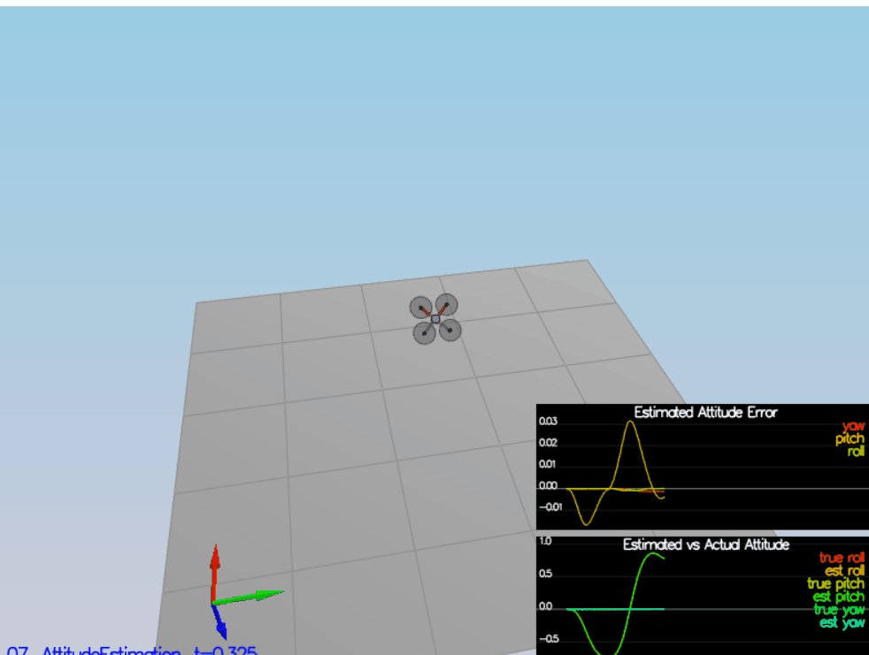
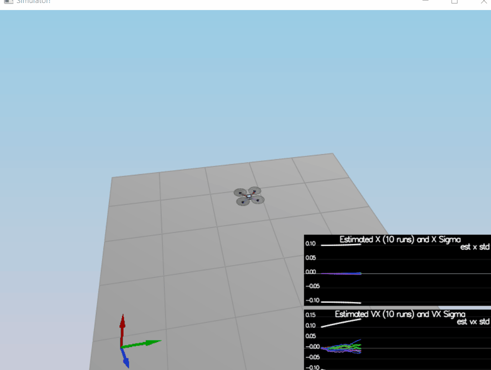

# Quadrotor Estimation Project #

In this project, the estimation portion of the controller used in the CPP simulator will be developed.  By the end of the project, the simulated quad will be flying with the designed estimator and custom controller (from the previous project)!

This README is broken down into the following sections:

 - [Setup](#setup) - the environment and code setup required to get started and a brief overview of the project structure
 - [The Tasks](#the-tasks) - the tasks completed for the project


## Setup ##

This project will continue to use the C++ development environment you set up in the Controls C++ project.

 1. Clone the repository
 ```
 git clone https://github.com/MeRKeZ/FlyingCar_Estimation.git
 ```

 2. Import the code into your IDE like done in the [Controls C++ project](https://github.com/udacity/FCND-Controls-CPP#development-environment-setup)
 
 3. You should now be able to compile and run the estimation simulator just as you did in the controls project


#### `config` Directory ####

In the `config` directory,  in addition to finding the configuration files for your controller and your estimator, you will also see configuration files for each of the simulations. For this project, you will be working with simulations 06 through 11 and you may find it insightful to take a look at the configuration for the simulation.

As an example, if we look through the configuration file for scenario 07, we see the following parameters controlling the sensor:

```
# Sensors
Quad.Sensors = SimIMU
# use a perfect IMU
SimIMU.AccelStd = 0,0,0
SimIMU.GyroStd = 0,0,0
```

This configuration tells us that the simulator is only using an IMU and the sensor data will have no noise.  You will notice that for each simulator these parameters will change slightly as additional sensors are being used and the noise behavior of the sensors change.


## The Tasks ##

At each step, there will be a set of accomplished success criteria that will be displayed both in the plots and in the terminal output.
Project outline:

 - [Step 1: Sensor Noise](#step-1-sensor-noise)
 - [Step 2: Attitude Estimation](#step-2-attitude-estimation)
 - [Step 3: Prediction Step](#step-3-prediction-step)
 - [Step 4: Magnetometer Update](#step-4-magnetometer-update)
 - [Step 5: Closed Loop + GPS Update](#step-5-closed-loop--gps-update)
 - [Step 6: Adding Your Controller](#step-6-adding-your-controller)


### Step 1: Sensor Noise ###

For the controls project, the simulator was working with a perfect set of sensors, meaning none of the sensors had any noise.  The first step to adding additional realism to the problem, and developing an estimator, is adding noise to the quad's sensors.  For the first step, you will collect some simulated noisy sensor data and estimate the standard deviation of the quad's sensor.

1. Run the simulator

2. Choose scenario `06_NoisySensors`.  In this simulation, the interest is to record some sensor data on a static quad, so you will not see the quad move.  You will see two plots at the bottom, one for GPS X position and one for The accelerometer's x measurement.  The dashed lines are a visualization of a single standard deviation from 0 for each signal. 

3. Run the simulator. The dashed lines in the simulation will eventually turn green, indicating you’re capturing approx 68% of the respective measurements (which is what we expect within +/- 1 sigma bound for a Gaussian noise model) because `MeasuredStdDev_GPSPosXY` and `MeasuredStdDev_AccelXY` are adjusted correctly in `config/6_Sensornoise.txt`.

***Success criteria:*** *The standard deviations should accurately capture the value of approximately 68% of the respective measurements.*


### Step 2: Attitude Estimation ###

In this step, the complementary filter-type attitude filter with a better rate gyro attitude integration scheme is improved

1. Run scenario `07_AttitudeEstimation`.  For this simulation, the only sensor used is the IMU and noise levels are set to 0 (see `config/07_AttitudeEstimation.txt` for all the settings for this simulation).  There are two plots visible in this simulation.
   - The top graph is showing errors in each of the estimated Euler angles.
   - The bottom shows the true Euler angles and the estimates.
Observe that there’s quite a bit of error in attitude estimation.

2. In `QuadEstimatorEKF.cpp`, the function `UpdateFromIMU()` contains a complementary filter-type attitude filter.  To reduce the errors in the estimated attitude (Euler Angles), a better rate gyro attitude integration scheme is implementedi

***Success criteria:*** *The attitude estimator needs to get within 0.1 rad for each of the Euler angles for at least 3 seconds.*




### Step 3: Prediction Step ###

This time the prediction step of the filter is implemented.

1. Run scenario `08_PredictState`.  This scenario is configured to use a perfect IMU (only an IMU). Due to the sensitivity of double-integration to attitude errors, we've made the accelerometer update very insignificant (`QuadEstimatorEKF.attitudeTau = 100`).  

2. In `QuadEstimatorEKF.cpp`, the state prediction step in the `PredictState()` functon is implemented. 


3. Now let's introduce a realistic IMU, one with noise.  Run scenario `09_PredictionCov`. You will see a small fleet of quadcopter all using your prediction code to integrate forward. You will see two plots:
   - The top graph shows 10 (prediction-only) position X estimates
   - The bottom graph shows 10 (prediction-only) velocity estimates

4. In `QuadEstimatorEKF.cpp`, the partial derivative of the body-to-global rotation matrix in the function `GetRbgPrime()` is calculated.  

5. Run your covariance prediction and tune the `QPosXYStd` and the `QVelXYStd` process parameters in `QuadEstimatorEKF.txt` to try to capture the magnitude of the error you see. Note that as error grows our simplified model will not capture the real error dynamics (for example, specifically, coming from attitude errors), a good solution looks as follows:



Looking at this result, you can see that in the first part of the plot, our covariance (the white line) grows very much like the data.

***Success criteria:*** *This step doesn't have any specific measurable criteria being checked.*


### Step 4: Magnetometer Update ###

Up until now only the accelerometer and gyro for our state estimation are used. In this step, the information from the magnetometer is added to improve the filter's performance in estimating the vehicle's heading.

1. Run scenario `10_MagUpdate`.  This scenario uses a realistic IMU.

2. The parameter `QYawStd` (`QuadEstimatorEKF.txt`) is tuned for the QuadEstimatorEKF so that it approximately captures the magnitude of the drift

3. Magnetometer update in the function `UpdateFromMag()` is implemented. Resulting plot is shown:


***Success criteria:*** *The goal is to both have an estimated standard deviation that accurately captures the error and maintain an error of less than 0.1rad in heading for at least 10 seconds of the simulation.*


### Step 5: Closed Loop + GPS Update ###

1. Run scenario `11_GPSUpdate`.  At the moment this scenario is using both an ideal estimator and and ideal IMU.

2. Let's change to using your estimator by setting `Quad.UseIdealEstimator` to 0 in `config/11_GPSUpdate.txt`.  Rerun the scenario to get an idea of how well your estimator work with an ideal IMU.

3. Now repeat with realistic IMU by commenting out these lines in `config/11_GPSUpdate.txt`:
```
#SimIMU.AccelStd = 0,0,0
#SimIMU.GyroStd = 0,0,0
```

4. The process noise model in `QuadEstimatorEKF.txt` is tuned to try to approximately capture the error seen with the estimated uncertainty (standard deviation) of the filter.

5. The EKF GPS Update in the function UpdateFromGPS()` is implemented `


***Success criteria:*** *Your objective is to complete the entire simulation cycle with estimated position error of < 1m.*

At this point, congratulations on having a working estimator!

### Step 6: Adding the Previous Controller ###

Up to this point, we have been working with a controller that has been relaxed to work with an estimated state instead of a real state.  So now, you will see how well your controller performs and de-tune your controller accordingly.

1. `QuadController.cpp` with the controller from the last project.

2. `QuadControlParams.txt` with the control parameters you came up with in the last project.

3. The scenario `11_GPSUpdate` is run. 


***Success criteria:*** *Your objective is to complete the entire simulation cycle with estimated position error of < 1m.*